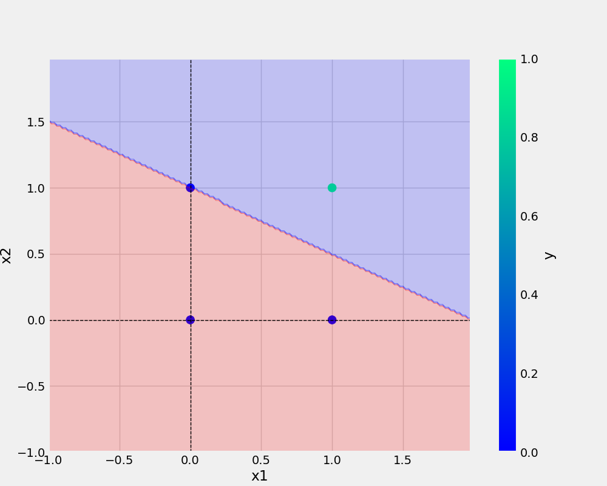

# perceptron
perceptron implementation

## ADD URL

[Git handbook](https://guides.github.com/introduction/git-handbook/)

<a href="https://guides.github.com/introduction/git-handbook/)"> Git handbook using html anchor tag</a>

[Conda for python](https://www.youtube.com/watch?v=23aQdrS58e0)

## Authors

[@Arjun](https://github.com/arjunaju123)


## ADD IMAGE




# PYTHON COMMANDS USED

```python

     def __init__(self, eta, epochs):
        self.weights = np.random.randn(3) * 1e-4 # SMALL WEIGHT INIT
        logging.info(f"initial weights before training: \n{self.weights}")
        self.eta = eta # LEARNING RATE
        self.epochs = epochs 

```
## Bash COMMANDS

```bash
     git add . && git commit -m "Readme updated" && git push origin main
```

## TABLE

x1 | x2 | y
-|-|-
0|0|0|
0|1|0|
1|0|0|
1|1|1|

###
* point 1
* point 2
1. point


